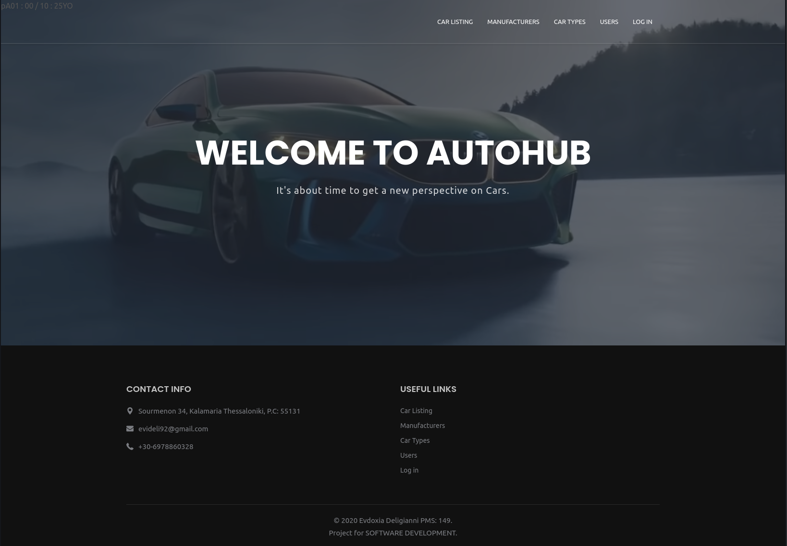

<h1 align="left">AutoHub Rest API</h1>
 

 
 

Rest API developed with the Django Rest Framework in Python and is consumed from the AutoHub mobile app. This project was developed for the course Software Development of the Msc program in the Applied Informatics department of the International Hellenic University. Its main features are:

• Serve a list of all car models available in an SQLite database  
• Allow the mobile application to search for specific car models, car brands or car types by providing filters functionality  
• Serve the details of each specific car model  
• Administration panel which allows for Admin users to enter new records to the database  
• Python 3 compatible  
• Served online in the PythonAnywhere platform  
• Presents a simple showcase frontend page with a live video, written in HTML/CSS/JS and used Bootstrap, JQuery and Font-Awesome

## Author
[Evdoxia Deligianni](https://github.com/evideli)

## Version
1.0
